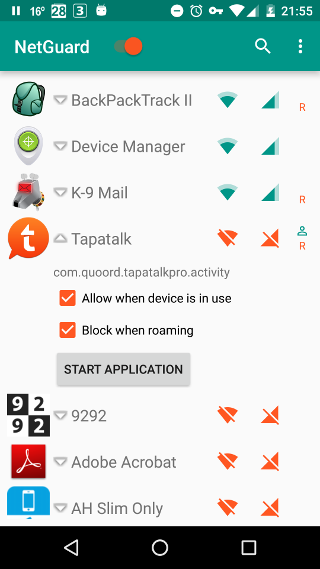
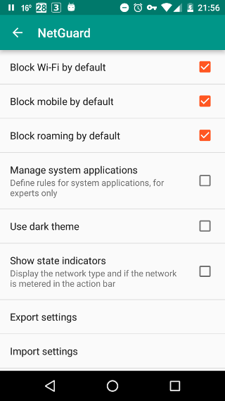

# NetGuard

*NetGuard* provides a simple way to block access to the internet - no root required.
Applications can individually be allowed or denied access to your Wi-Fi and/or mobile connection.

Blocking access to the internet can help:

* reduce your data usage
* save your battery
* increase your privacy

NetGuard is the first free and open source no-root firewall for Android.

Features:

* No root required
* Simple to use
* Free of charge
* Open source
* No extra battery usage
* No bandwidth reduction
* No calling home
* No tracking or analytics
* No ads
* No internet permission required
* IPv4/IPv6 TCP/UDP supported
* Optionally allow when screen on
* Optionally block when roaming
* Optionally block system applications
* Material design

There is no other no-root firewall offering all these features.
Most other firewall solutions will use extra battery and reduce the overall network speed.

Most of these features are the result of sending selected traffic to a sinkhole, instead of filtering all internet traffic.
This means that advanced features, like address based filtering (needed for ad blocking), traffic logging, and on-demand configuration, are not possible.
Routing selected traffic into a sinkhole relies on an API introduced in Android 5.0 (Lollipop),
therefore older Android versions unfortunately cannot be supported.

Since NetGuard has no internet permission, you know your internet traffic is not being sent anywhere.

Downloads:

* [GitHub](https://github.com/M66B/NetGuard/releases)
* [On Google Play](https://play.google.com/store/apps/details?id=eu.faircode.netguard) (stable)
* [On Google Play](https://play.google.com/apps/testing/eu.faircode.netguard) (beta)
* [F-Droid](https://f-droid.org/repository/browse/?fdfilter=netguard&fdid=eu.faircode.netguard) (unsupported, often outdated)
* [XDA Labs App](http://forum.xda-developers.com/android/apps-games/labs-t3241866) ([web page](https://labs.xda-developers.com/store/app/eu.faircode.netguard))

Usage:

* Enable the firewall using the switch in the action bar
* Allow/deny Wi-Fi/mobile internet access using the icons along the right side of the application list

You can use the settings menu to change from black list to white list mode.

* Orange = denied internet access
* Green = allowed internet access

Compatibility
-------------

Devices / ROMs with a broken VPN implementation:

* Asus™ ZenFone 2 / Android 5.0.2, [reported on XDA](http://forum.xda-developers.com/showpost.php?p=63619542&postcount=121) (all traffic blocked)
* Asus™ ZenFone 4 / Android 5.0 (reported in the Google Play™ store app) (all traffic blocked)
* Asus™ ZenFone 5 / Android 5.0 (reported through Google Play™ store app feedback) (prepare fails)
* Asus™ ZenPad S 8.0 / Android 5.0, [reported on Github](https://github.com/M66B/NetGuard/issues/168) (all traffic blocked)
* BQ™ Aquaris E5/M5 / Android 5.0.2/5.0 (reported in the Google Play™ store app) (all traffic blocked)
* Lenovo™ Yoga Tablet Pro-1380L / 2 Pro / Android 5.0.1, [reported on XDA](http://forum.xda-developers.com/showpost.php?p=63784102&postcount=278) (all traffic blocked)
* LGE G2 Mini (D620) / Android 5.0.2, [reported on XDA](http://forum.xda-developers.com/showpost.php?p=63987178&postcount=437) (prepare fails)
* Samsung™ Galaxy A5 / Android 5.0.2, [reported on Github](https://github.com/M66B/NetGuard/issues/20) (all traffic blocked)
* Samsung™ Galaxy Note3 / Android 5.0 (reported through Google Play™ store app feedback) (prepare fails)
* Sony™ Xperia™ M4 Aqua Dual / Android 5.0 (reported in the Google Play™ store app) (all traffic blocked)
* Symphony Teleca™ / Micromax™ Canvas Knight 2 E471 / Android 5.0.2 (reported by e-mail) (VPN establish fails)
* TCT Mobile Limited™ (Alcatel) 6039Y / Android / Android 5.0 (reported in the Google Play™ store app) (all traffic blocked)
* TCT Mobile Limited™ (Alcatel) OneTouch Idol 3 / Android 5.0.2 (reported in the Google Play™ store app) (all traffic blocked)

NetGuard will crash when the package *com.android.vpndialogs* has been removed or otherwise is unavailable.

Tethering will not work when NetGuard is enabled due to a bug in Android ([issue](https://github.com/M66B/NetGuard/issues/42)).

Unfortunately it is not possible to workaround any of these Android problems.

Frequently Asked Questions (FAQ)
--------------------------------

[**(0) How do I use NetGuard?**](https://github.com/M66B/NetGuard/blob/master/FAQ.md#FAQ0)

[**(1) Can NetGuard completely protect my privacy?**](https://github.com/M66B/NetGuard/blob/master/FAQ.md#FAQ1)

[**(2) Can I use another VPN application while using NetGuard?**](https://github.com/M66B/NetGuard/blob/master/FAQ.md#FAQ2)

[**(3) Can I use NetGuard on any Android version?**](https://github.com/M66B/NetGuard/blob/master/FAQ.md#FAQ3)

[**(4) Will NetGuard use extra battery power?**](https://github.com/M66B/NetGuard/blob/master/FAQ.md#FAQ4)

[**(5) Can you add selective allowing/blocking applications/IP addresses?**](https://github.com/M66B/NetGuard/blob/master/FAQ.md#FAQ5)

[**(6) Will NetGuard send my internet traffic to an external (VPN) server?**](https://github.com/M66B/NetGuard/blob/master/FAQ.md#FAQ6)

[**(7) Why are applications without internet permission shown?**](https://github.com/M66B/NetGuard/blob/master/FAQ.md#FAQ7)

[**(8) What do I need to enable for the Google Play™ store app to work?**](https://github.com/M66B/NetGuard/blob/master/FAQ.md#FAQ8)

[**(9) Why is the VPN service being restarted?**](https://github.com/M66B/NetGuard/blob/master/FAQ.md#FAQ9)

[**(10) Will you provide a Tasker plug-in?**](https://github.com/M66B/NetGuard/blob/master/FAQ.md#FAQ10)

[**(12) Can you add on demand asking to block/allow access?**](https://github.com/M66B/NetGuard/blob/master/FAQ.md#FAQ12)

[**(13) How can I remove the ongoing NetGuard entry in the notification screen?**](https://github.com/M66B/NetGuard/blob/master/FAQ.md#FAQ13)

[**(14) Why can't I select OK to approve the VPN connection request?**](https://github.com/M66B/NetGuard/blob/master/FAQ.md#FAQ14)

[**(15) Why won't you support the F-Droid builds?**](https://github.com/M66B/NetGuard/blob/master/FAQ.md#FAQ15)

[**(16) Why are some applications shown dimmed?**](https://github.com/M66B/NetGuard/blob/master/FAQ.md#FAQ16)

[**(17) Why is NetGuard using so much memory?**](https://github.com/M66B/NetGuard/blob/master/FAQ.md#FAQ17)

[**(18) Why can't I find NetGuard in the Google Play™ store app?**](https://github.com/M66B/NetGuard/blob/master/FAQ.md#FAQ18)

[**(19) Why does aplication XYZ still have internet access?**](https://github.com/M66B/NetGuard/blob/master/FAQ.md#FAQ19)

[**(20) Can I Greenify/hibernate NetGuard?**](https://github.com/M66B/NetGuard/blob/master/FAQ.md#FAQ20)

[**(21) Does doze mode affect NetGuard?**](https://github.com/M66B/NetGuard/blob/master/FAQ.md#FAQ21)

[**(22) Can I tether while using NetGuard?**](https://github.com/M66B/NetGuard/blob/master/FAQ.md#FAQ22)

[**(24) Can you remove the notification from the status bar?**](https://github.com/M66B/NetGuard/blob/master/FAQ.md#FAQ24)

Permissions
-----------

* ACCESS_NETWORK_STATE: to check if the device is connected to the internet through Wi-Fi
* RECEIVE_BOOT_COMPLETED: to start the firewall when booting the device
* WAKE_LOCK: to reliably reload rules in the background on connectivity changes
* com.android.vending.BILLING: to accept donations via in-app billing

Support
-------

* Questions: please [use this XDA-Developers forum thread](http://forum.xda-developers.com/showthread.php?t=3233012)
* Feature requests and bugs: please [create an issue on GitHub](https://github.com/M66B/NetGuard/issues/new)

Please do not use GitHub for questions.

Contributing
------------

Translations:

* Translations to other languages are welcomed
* You can translate online [here](https://crowdin.com/project/netguard/)
* If your language is not listed, please send a message to marcel(plus)netguard(at)faircode(dot)eu

Current translations:

1. Arabic (ar)
1. Simplified Chinese (zh-rCN)
1. Dutch (nl)
1. English
1. French (fr)
1. German (de)
1. Italian (it)
1. Japanese (ja)
1. Korean (ko)
1. Polish (pl)
1. Portuguese/Brazilian (pt-rBR)
1. Romanian (ro)
1. Russian (ru)
1. Slovak (sk)
1. Spanish (es)
1. Turkish (tr)
1. Ukrainian (uk)

You can see the actual status of all translations [here](https://crowdin.com/project/netguard).

Please note that you agree to the license below by contributing, including the copyright.

Attribution
-----------

NetGuard uses:

* [Picasso](http://square.github.io/picasso/)
* [Android Support Library](https://developer.android.com/tools/support-library/index.html)

License
-------

[GNU General Public License version 3](http://www.gnu.org/licenses/gpl.txt)

Copyright (c) 2015 Marcel Bokhorst ([M66B](http://forum.xda-developers.com/member.php?u=2799345))

All rights reserved

This file is part of NetGuard.

NetGuard is free software: you can redistribute it and/or modify
it under the terms of the GNU General Public License as published by
the Free Software Foundation, either version 3 of the License, or
(at your discretion) any later version.

NetGuard is distributed in the hope that it will be useful,
but WITHOUT ANY WARRANTY; without even the implied warranty of
MERCHANTABILITY or FITNESS FOR A PARTICULAR PURPOSE.  See the
GNU General Public License for more details.

You should have received a copy of the GNU General Public License
along with NetGuard. If not, see [http://www.gnu.org/licenses/](http://www.gnu.org/licenses/).

*Android is a trademark of Google Inc. Google Play is a trademark of Google Inc*
