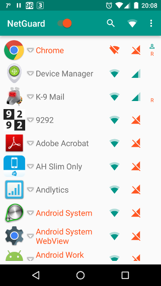

# NetGuard

NetGuard is possibly the first free and open source no-root firewall for Android.

Features
--------

* No root required
* Simple to use
* Free of charge
* Open source
* No extra battery usage
* No calling home
* No tracking or analytics
* No ads
* IPv4/IPv6 TCP/UDP supported

NetGuard doesn't even require the *internet* permission!

Usage
-----

* Enable the firewall using the switch in the action bar
* Allow/deny WiFi/mobile internet access using the icons at the right side of the application list

Permissions
-----------

* ACCESS_NETWORK_STATE: to check if the device is connected to the internet through WiFi
* RECEIVE_BOOT_COMPLETED: to start the firewall when starting the device

Frequently Asked Questions (FAQ)
--------------------------------

**(1) Can NetGuard completely protect my privacy?**

No - nothing can completely protect your privacy.
NetGuard will do its best, but it is limited by the fact it must use the VPN service.
This is the trade-off required to make a firewall which does not require root access.
The firewall can only start when Android "allows" it to start,
so it will not offer protection during early boot-up (although your network may not be loaded at that time).
It will, however, be much better than nothing, especially if you are not rebooting often.

If you want to protect yourself more, you can (at least in theory) disable WiFi and mobile data before rebooting,
and only enable them on reboot, after the firewall service has started (and the small key icon is visible in the status bar).

Thanks @[pulser](https://github.com/pulser/)

**(2) Can I use VPN applications while using NetGuard?**

If the VPN application is using the [VPN service](http://developer.android.com/reference/android/net/VpnService.html),
then no, because NetGuard needs to use this service, and Android allows only one application at a time to use this service.

**(3) Can I use NetGuard on any Android version?**

No, because the method [addDisallowedApplication](http://developer.android.com/reference/android/net/VpnService.Builder.html#addDisallowedApplication(java.lang.String))
is being used, the minimum required Android version is 5.0 (Lollipop).

**(4) Will NetGuard use extra battery power?**

No, unlike most of the similar closed source alternatives.

Support
-------

* Questions: please [use this XDA-Developers forum thread](http://forum.xda-developers.com/showthread.php?t=3233012)
* Feature requests and bugs: please [report an issue on GitHub](https://github.com/M66B/NetGuard/issues/new)

Please do not use GitHub for questions.

Contributing
------------

Translations:

* Translations to other languages are welcomed
* Check if the language [is supported by Android](http://stackoverflow.com/questions/7973023/what-is-the-list-of-supported-languages-locales-on-android) and find its locale
* Copy [this file](https://github.com/M66B/NetGuard/blob/master/app/src/main/res/values/strings.xml) to the correct locale folder
* Translate the strings in the copied file and omit all lines with **translatable="false"**
* Create a [pull request on GitHub](https://help.github.com/articles/using-pull-requests) for the new/updated translation

Please note that you agree to the license below by contributing, including the copyright.

License
-------

[GNU General Public License version 3](http://www.gnu.org/licenses/gpl.txt)

Copyright (c) 2015 Marcel Bokhorst ([M66B](http://forum.xda-developers.com/member.php?u=2799345))

All rights reserved

This file is part of NetGuard.

NetGuard is free software: you can redistribute it and/or modify
it under the terms of the GNU General Public License as published by
the Free Software Foundation, either version 3 of the License, or
(at your discretion) any later version.

NetGuard is distributed in the hope that it will be useful,
but WITHOUT ANY WARRANTY; without even the implied warranty of
MERCHANTABILITY or FITNESS FOR A PARTICULAR PURPOSE.  See the
GNU General Public License for more details.

You should have received a copy of the GNU General Public License
along with NetGuard. If not, see [http://www.gnu.org/licenses/](http://www.gnu.org/licenses/).
